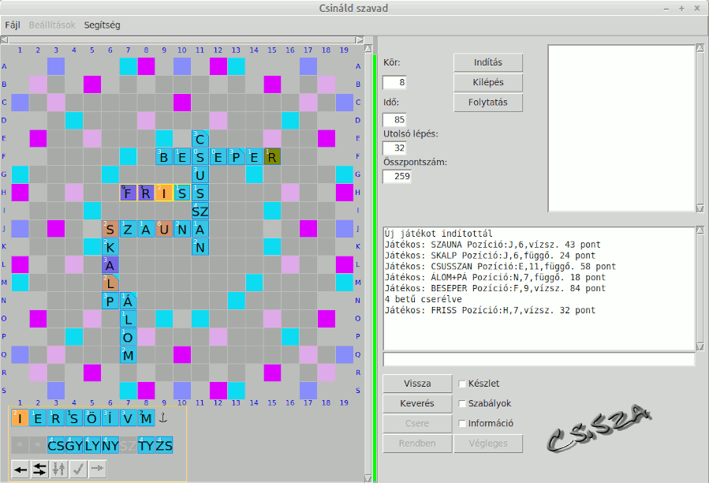

 

# CsiSza v0.3

## Változások:
- A szótár frissítése 2.2 verzióra.
- Kezelési útmutató.
- A tábla mezőihez 1-9 pontos jutalom rendelhető.
- A kerülhetnek a táblára a játék indításakor kisorsolt betűk.
- Nagyobb, "felfedezhető" táblák beláthatósága korlátozható.
- A betűtartókat összefogó szabadon mozgatható tálca, kiegészítve a gyakrabban használt funkciókat megvalósító gyorsgombokkal.
- A magánhangzók+dzsókerek és a mássalhangzók aránya befolyásolható.
- A közös betűk tartójára beállítható, hogy a kirakott betű helyére újabb kerüljön a következő körre. 
- A szavak érvényességének ellenőrzése történhet csak a játék végén.
- Ha a szavak érvényességének ellenőrzése csak a játék végén történik, akkor a felesleges betűk megjelölhetőek, és figyelmen kívül     lesznek hagyva a pontszámításnál. Ilyen típusú játéknál beállíthatóak a szavak hossza alapján számolt jutalmak.  
- Sok apró javítás.

# CsiSza v0.21

## Változások:

- A szótár frissítése 2.1 verzióra. 
 
# CsiSza v0.2

## Változások:

- A gépi ellenfelek külön-külön beállíthatóak. A szókészletük lehet teljes, kevesebb mint 40000 szó vagy kevesebb mint 20000 szó. Megadható az erősségük százalékban is. 
- A betűkészletek szerkesztési lehetőségei kiegészültek új, beszúrás és törlés funkciókkal. 
- Egyéb apró javítások.

# CsiSza v0.1

Betűjáték számos beállítási és táblaszerkesztési lehetőséggel, egyszemélyes
és gépi játékos elleni játékkal, magyar nyelven.

Saját szórakoztatásomra készítettem ezt a programot, de úgy gondolom, hogy mások számára is hasznos
lehet. A GPLv3 licenc alapján használható, semmiféle garancia nincs a rendeltetésszerű működésére,
és a készítője semmilyen felelősséget nem vállal a program használatából eredő esetleges károkért.

Teljesen amatőrként, a Python nyelvvel éppen csak ismerkedve, elsősorban a betűjáték kategória kedvelőjeként
fogtam hozzá. Mindenféle tervezés nélkül megszakításokkal több éven át készült. A menet közben felmerülő újabb
és újabb ötletek, és a megvalósításuk útjában álló akadályok (pl. Python 2.7 -> Python 3.5) következtében egyes
részek többször változtak, de vannak benne jócskán első verzióban, közel nulla nyelvismerettel írt részek is.
Mindezeket csak mentegetőzésképpen írom, azt jelezve, hogy senki ne várjon egy kész, működőképes programot,
jól olvasható, következetes kódot.

Gérard Swinnen Tanuljunk meg programozni Python nyelven című könyvének (mek.oszk.hu/08400/08435/08435.pdf)
példaprogramjai szolgáltak kiindulási alapul. Sok ötlet, megoldás, programrészlet származik
a stackoverflow.com oldalon található diskurzusokból.

## Teendők:
  - [ ] hibák javítása
  - [x] használható dokumentáció
  - [x] választható erősségű (szókincs korlátozása, vagy a legjobb szó pontértékének százalékában
        korlátozott) gépi ellenfél a szimultán játékhoz
  - [ ] választható erősségű és játékstílusú (szókincs, stratégia) gépi ellenfél egyéb játékhoz
  - [ ] GUI tökéletesítése
  - [ ] távoli játék
  - [x] új funkciók

License

This program is free software: you can redistribute it and/or modify
it under the terms of the GNU General Public License as published by
the Free Software Foundation, either version 3 of the License, or
(at your option) any later version.

This program is distributed in the hope that it will be useful,
but WITHOUT ANY WARRANTY; without even the implied warranty of
MERCHANTABILITY or FITNESS FOR A PARTICULAR PURPOSE.  See the
GNU General Public License for more details.

You should have received a copy of the GNU General Public License
along with this program.  If not, see <http://www.gnu.org/licenses/>.
